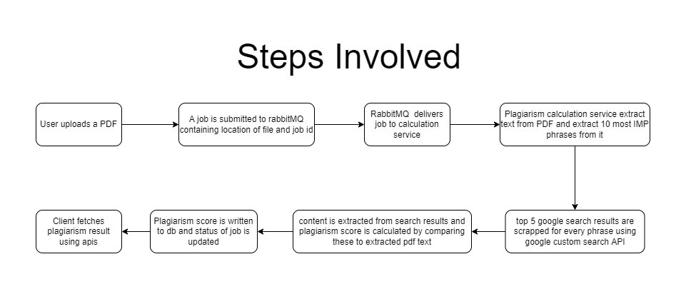
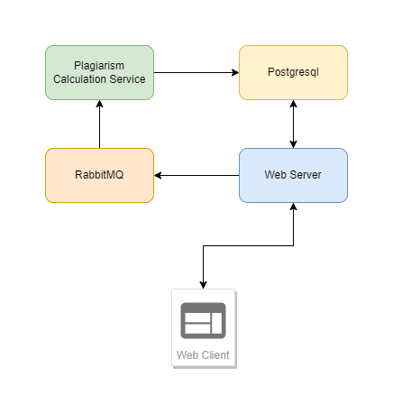

# Plagiarism checker

An online plagiarism checker service that checks PDFs for plagiarism against articleson wikipedia(en). Tech stack includes Go, PostgreSQL, RabbitMQ, Google Custom Search API, React, Typescript.

> ## Live demo (deployed on a GCP compute engine) - [https://plagiarismchecks.com](https://plagiarismchecks.com/)

# tech stack
go, postgreSQL, rabbitMQ, javascript, react, typescript, chakra UI

# How it works

# Backend design

# UI design

